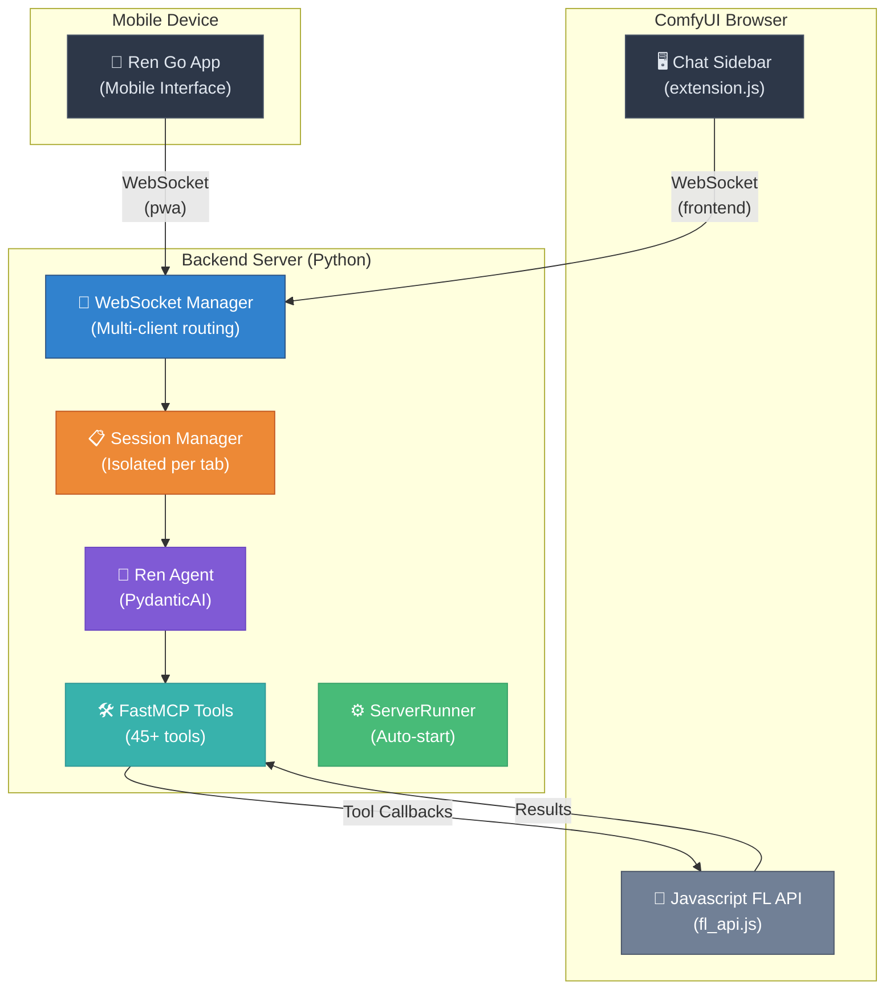

# Ren - ComfyUI Assistant 🌸

> **Your AI companion for ComfyUI workflows** - Create, modify, and understand workflows through natural conversation. Available on desktop and mobile.

[](https://opensource.org/licenses/MIT)
[](https://www.python.org/downloads/)
[](https://github.com/comfyanonymous/ComfyUI)

---

## ✨ Features

### 🎯 Natural Language Workflow Control
- **Chat with your workflow** - "Create a txt2img workflow with SDXL"
- **Modify on the fly** - "Change all KSampler steps to 30"
- **Query your graph** - "Show me all nodes connected to the checkpoint loader"
- **Visual feedback** - Get Mermaid diagrams of your workflow structure

### 📱 Ren Go - Mobile App
- **Mobile access** - Control ComfyUI from your phone
- **Session picker** - Connect to any active ComfyUI session
- **Smart notifications** - Get notified when workflows complete or fail
- **Ren links** - One-tap actions like "Show me the output"
- **Offline support** - App works offline, reconnects automatically
- **Multi-device** - Use desktop and mobile simultaneously

📖 **[Complete Ren Go Setup Guide](web/pwa/README.md)**

### 🛠️ Comprehensive Tool Suite (45+ Tools)
- **Node Management** - Create, find, remove, bypass, pin, and select nodes
- **Node Manipulation** - Get/set parameters, connect nodes intelligently
- **Layout Control** - Auto-arrange workflows, position nodes relative to each other
- **Workflow Execution** - Queue, cancel, batch processing, monitor status
- **Advanced Queries** - Filter nodes, traverse connections, aggregate data
- **ComfyUI Filesystem** - Browse custom nodes, models, search files securely
- **Node Pack Discovery** - Search and discover custom node packs via Manager
- **System Information** - OS, Python, and environment detection for help
- **Canvas Control** - Focus on nodes, take screenshots for visual debugging

### 🧠 Intelligent Agent (Ren)
- **Context-aware** - Remembers conversation history and workflow state
- **Proactive suggestions** - Warns about disconnected nodes, suggests improvements
- **Best practices** - Knows ComfyUI patterns and common workflow structures
- **Multi-LLM support** - Works with OpenAI, Anthropic Claude, Google Gemini, or OpenRouter

### 🎨 Native ComfyUI Integration
- **Sidebar panel** - Seamlessly integrated into ComfyUI's left drawer
- **Dark theme** - Matches ComfyUI's aesthetic perfectly
- **Real-time updates** - WebSocket-based instant communication
- **Multi-session** - Each browser tab gets its own isolated agent
- **🆕 Auto-start backend** - No manual server startup required!

---

## Meet Ren 🌸

**Ren** (連 - "connection" in Japanese) is your AI assistant for ComfyUI workflows. The name reflects the core purpose: connecting you to your creative workflow through natural conversation.

### What makes Ren special?

- **Conversational**: Talk naturally, no commands to memorize
- **Proactive**: Suggests improvements and catches potential issues
- **Educational**: Explains concepts and teaches best practices
- **Adaptive**: Matches your skill level and workflow style
- **Multi-device**: Available on desktop and mobile (Ren Go)
- **Always learning**: Understands context from your conversation history

### Example Conversations

**Creating Workflows:**
```
You: "Create a simple text-to-image workflow"

Ren: "I'll create a basic txt2img workflow for you."
     [Creates and connects nodes: CheckpointLoader → CLIPTextEncode 
      → EmptyLatentImage → KSampler → VAEDecode → SaveImage]
     "Done! I've created a complete workflow with 7 nodes."
```

**Modifying Workflows:**
```
You: "Change the sampler to use 40 steps with euler_ancestral"

Ren: "I'll update the KSampler settings."
     [Finds KSampler node, sets steps=40, sampler_name="euler_ancestral"]
     "Updated! The sampler now uses 40 steps with euler_ancestral."
```

**Understanding Workflows:**
```
You: "Show me all LoRA nodes and their weights"

Ren: [Queries workflow, finds LoRA loaders]
     "Found 2 LoRA nodes:
      - Node #5: 'detail_enhancer.safetensors' (weight: 0.8)
      - Node #12: 'style_helper.safetensors' (weight: 0.6)"
```

**Debugging:**
```
You: "The generation failed, what went wrong?"

Ren: [Analyzes recent errors]
     "I found the issue - node #7 (KSampler) has a disconnected 'model' input.
      Let me connect it to your checkpoint loader."
     [Fixes connection]
     "Fixed! Try queuing it again."
```

**Discovery:**
```
You: "What node packs have video processing?"

Ren: [Searches ComfyUI Manager]
     "I found 3 popular video node packs:
      1. ComfyUI-VideoHelperSuite (⭐ 892)
      2. ComfyUI-Advanced-ControlNet (⭐ 1.2k) 
      3. ComfyUI-Frame-Interpolation (⭐ 456)
      
      Would you like details on any of these?"
```

**System Help:**
```
You: "How do I install this custom node?"

Ren: [Checks system info]
     "You're on Windows with Python 3.11 in a conda environment.
      
      To install, run:
      ```bash
      conda activate comfy
      cd ComfyUI/custom_nodes
      git clone <repo_url>
      cd <node_folder>
      pip install -r requirements.txt
      ```
      
      Then restart ComfyUI."
```

---

## 🚀 Quick Start

### Prerequisites
- **ComfyUI** installed and working
- **Python 3.11+** for the backend server
- **API Key** for your chosen LLM provider (OpenAI, Anthropic, Google, or OpenRouter)

### Installation

#### 1. Clone into ComfyUI custom_nodes directory
```bash
cd /path/to/ComfyUI/custom_nodes
git clone https://github.com/yourusername/fl_js.git FL_JS
cd FL_JS
```

> **Important:** The directory must be named `FL_JS` (or your preferred name) inside `custom_nodes/`

#### 2. Install Python dependencies
```bash
pip install -r requirements.txt
```

> **Note:** Use ComfyUI's Python environment if you have a custom setup.

#### 3. Configure your LLM provider

Copy the example environment file:
```bash
cp .env.example .env
```

Edit `.env` with your settings:

```bash
# Choose your provider: openai, anthropic, gemini, or openrouter
LLM_PROVIDER=gemini

# Add your API key for the chosen provider
GOOGLE_API_KEY=your-key-here

# Model name is OPTIONAL - intelligent defaults are used
# Leave blank to use the recommended default for your provider
LLM_MODEL=
```

> **💡 Smart Defaults:** If you don't specify `LLM_MODEL`, the system automatically uses the best model for your provider. See [Provider Configuration](#-provider-configuration) below for details.

#### 4. Start ComfyUI

🎉 **That's it!** The backend starts automatically when ComfyUI loads:

```bash
cd /path/to/ComfyUI
python main.py
```

You should see:
```
================================================================================
[FL_JS] Initializing FL_JS Agentic System...
================================================================================
[FL_JS] Starting backend server on port 8000...
[FL_JS] Waiting for backend to be ready... Ready!
[FL_JS] Backend server started successfully! (PID: 12345)
[FL_JS] Auto-restart monitoring enabled
================================================================================
[FL_JS] Initialization complete!
================================================================================
```

**How the Server Starts:**

Ren's backend can start in two ways:

1. **Automatic (Default)** - ComfyUI starts and stops the server automatically
   - Server starts when ComfyUI loads
   - Server stops when ComfyUI exits
   - Logs to `backend/logs/server.log`
   - Perfect for normal use

2. **Manual (For Debugging)** - You start the server separately
   - Better visibility of logs in separate terminal
   - Easier to debug server issues
   - Server runs independently of ComfyUI
   
   To use manual mode:
   ```bash
   # In .env, set:
   AUTO_START_BACKEND=false
   
   # Then start server manually in separate terminal:
   cd backend
   python server.py
   ```

> **💡 Tip:** Use manual mode when debugging server issues. The separate terminal shows all logs clearly without ComfyUI's output mixed in.

#### 5. Verify installation

Open ComfyUI in your browser and check the **browser console** (F12):

```
[FL_JS] Extension module loaded
[FL_JS] Initializing Agentic System extension...
[FL_JS] Session ID: xxxxxxxx-xxxx-4xxx-yxxx-xxxxxxxxxxxx
[FL_JS] Connecting to backend server...
[FL_JS] WebSocket connected
[FL_JS] Handshake complete: connected
[FL_JS] Extension initialized successfully!
```

If you see these messages, **you're ready to go!** 🎉

#### 6. Access from Mobile (Optional)

Ren Go is a Progressive Web App that lets you control ComfyUI from your phone.

📖 **[Complete Setup Guide](web/pwa/README.md)** - Local network, ngrok, and Cloudflare options

**Quick Local Network Setup:**
1. Find your computer's IP address:
   - Windows: `ipconfig` (look for IPv4)
   - Mac/Linux: `ifconfig` or `ip addr`
2. On your phone, navigate to: `http://[YOUR-IP]:8000/pwa`
3. Select your ComfyUI session from the picker
4. Add to home screen for app-like experience

**For remote access** (cellular data, different networks), see the [PWA Setup Guide](web/pwa/README.md) for ngrok and Cloudflare tunnel options.

---

## 🔌 Provider Configuration

### Intelligent Provider Defaults

FL_JS uses **smart defaults** for each provider. You only need to set `LLM_PROVIDER` and the corresponding API key - the best model is chosen automatically:

| Provider | Default Model | API Key Required |
|----------|---------------|------------------|
| **OpenAI** | `gpt-4-turbo-preview` | `OPENAI_API_KEY` |
| **Anthropic** | `claude-3-5-sonnet-20241022` | `ANTHROPIC_API_KEY` |
| **Gemini** | `gemini-2.0-flash-exp` | `GOOGLE_API_KEY` |
| **OpenRouter** | `deepseek/deepseek-chat` | `OPENROUTER_API_KEY` |

### Quick Provider Switch

Switching providers is as simple as changing two lines in `.env`:

```bash
# Switch to Gemini
LLM_PROVIDER=gemini
GOOGLE_API_KEY=your-google-key

# Switch to Claude
LLM_PROVIDER=anthropic
ANTHROPIC_API_KEY=your-anthropic-key

# Switch to OpenAI
LLM_PROVIDER=openai
OPENAI_API_KEY=your-openai-key

# Switch to OpenRouter (access 100+ models)
LLM_PROVIDER=openrouter
OPENROUTER_API_KEY=your-openrouter-key
```

Restart ComfyUI and you're using the new provider! 🚀

### Model Override (Optional)

Want to use a specific model? Just set `LLM_MODEL` in `.env`:

```bash
# Use GPT-4 instead of default
LLM_PROVIDER=openai
LLM_MODEL=gpt-4

# Use Claude Opus instead of Sonnet
LLM_PROVIDER=anthropic
LLM_MODEL=claude-3-opus-20240229

# Use Gemini 1.5 Pro instead of 2.0 Flash
LLM_PROVIDER=gemini
LLM_MODEL=gemini-1.5-pro

# Use any model through OpenRouter
LLM_PROVIDER=openrouter
LLM_MODEL=anthropic/claude-3.5-sonnet
```

### Provider-Specific Optimizations

FL_JS automatically tunes behavior for each provider:

- **Gemini**: Reduced message history (16 vs 36), compressed tool results for better JSON generation
- **Anthropic**: Extended context window (50 messages, 4000 chars per result)
- **OpenAI**: Balanced settings (36 messages, 2000 chars per result)
- **OpenRouter**: Same as OpenAI defaults

These optimizations happen **automatically** - no configuration needed!

---

## 🏗️ Architecture

### System Overview



**How It Works:**

1. **Frontend** (ComfyUI sidebar) and **PWA** (mobile) connect via WebSocket
2. **Session Manager** keeps conversations isolated per browser tab
3. **Ren Agent** processes messages using PydanticAI framework
4. **FastMCP Tools** provide 45+ capabilities for workflow control
5. **Tool Callbacks** execute in ComfyUI via FL_JS legacy functions
6. **ServerRunner** manages backend lifecycle automatically

**Multi-Client Support:**
- Desktop ComfyUI + Mobile PWA can connect to same session
- Both see same conversation history
- Tool execution happens on desktop ComfyUI
- Results broadcast to all connected clients

---

## 📁 Project Structure

```
FL_JS/
├── __init__.py              # ComfyUI node registration + auto-start
├── .env.example             # Configuration template
├── requirements.txt         # Python dependencies
├── pyproject.toml          # Python project config
├── README.md               # This file
│
├── backend/                # 🐍 Python FastAPI server
├── web/                    # 🌐 JavaScript frontend
│   ├── js/                # Extension code
│   │   └── _components/        # Reusable UI components
│   └── pwa/               # 📱 Progressive Web App (Ren Go)
│       └── icons/              # App icons
├── agents/                 # 🤖 AI agent configuration
│   └── agent.md           # Ren's system prompt
├── legacy/                 # 📦 Original FL_JS code
├── tests/                  # 🧪 Test suites
│   ├── backend/           # Backend unit tests
│   ├── frontend/          # Frontend tests
│   └── integration/       # End-to-end tests
└── notes/                  # 📝 Documentation & plans
```

**Key Folders Explained:**

- **`backend/`** - Python server handling AI, WebSocket, and tool orchestration
- **`web/js/`** - ComfyUI sidebar extension with chat UI and tool execution
- **`web/pwa/`** - Mobile Progressive Web App for remote access
- **`agents/`** - Ren's personality, capabilities, and behavior configuration
- **`legacy/`** - Original FL_JS implementation (still used for tool execution)
- **`tests/`** - Automated testing for reliability
- **`notes/`** - Development documentation and architectural decisions

---

## 📚 Advanced Topics

### Tool Categories

Ren has 45+ tools organized into categories:

**Workflow Analysis & Queries**
- `query_workflow` - Filter, traverse, and aggregate workflow data with structured queries
- `workflow_overview` - Get comprehensive workflow summary with statistics
- `workflow_diagram` - Generate Mermaid diagrams of workflow structure
- `get_current_node_selection` - Understand what user is currently examining

**Node Management**
- `create_nodes` - Batch create nodes with validation and positioning
- `find_node` - Search by ID, type, or title
- `remove_nodes`, `bypass_nodes`, `pin_nodes` - Workflow organization
- `select_nodes` - Programmatic node selection for user focus

**Node Discovery (Library)**
- `node_library_search` - Find available node types before creating
- `node_library_get_details` - Get parameter definitions and constraints
- `node_library_find_compatible` - Discover connection possibilities

**Node Pack Discovery (Manager)**
- `manager_search_nodes` - Search ComfyUI Manager for custom node packs
- `manager_get_node_mappings` - Find which pack provides a node type
- `manager_check_updates` - Check for available updates

**Node Manipulation**
- `get_node_values`, `set_node_values` - Parameter reading and modification
- `connect_nodes` - Smart connection with auto-matching by type
- `connect_nodes_batch` - Efficient batch connection operations
- `auto_connect_workflow` - Automatic sequential or type-based connections
- `get_node_slots` - Discover available inputs/outputs for connections

**Layout Management**
- `get_layout` - Retrieve spatial organization of nodes
- `modify_layout` - Batch position/size modifications with collision avoidance
- `focus_on_nodes` - Zoom canvas to specific nodes
- `take_screenshot` - Capture canvas for visual debugging

**Workflow Execution**
- `queue_workflow` - Execute with batch count control
- `cancel_workflow` - Stop running workflows
- `get_queue_status` - Monitor execution state
- `enable_auto_queue`, `disable_auto_queue` - Auto-execution mode

**Error Feedback & Debugging**
- `get_recent_errors` - Retrieve recent execution failures
- `get_errors_for_run` - Get all errors for specific workflow run
- `get_queue_status_details` - Active executions and progress
- `get_execution_details` - Comprehensive execution state
- `clear_error_buffer` - Reset error tracking

**ComfyUI Filesystem**
- `comfy_list_folders` - Browse custom_nodes, models, checkpoints, etc.
- `comfy_read_file` - Examine node implementations and configs
- `comfy_search_resources` - Find patterns in files (node registrations, etc.)
- `extract_workflow_from_image` - Extract workflow from PNG metadata

**System Information**
- `get_system_info` - OS, Python, environment detection for platform-specific help

**Utilities**
- `calculate_expressions` - Math AST evaluation for layout calculations
- `wait` - Delay execution for timing control
- `generate_seed`, `generate_int`, `generate_float` - Random value generation
- `random_choice` - Random selection from lists

### Multi-Session Architecture

Each browser tab gets isolated session:
- Unique `session_id` stored in localStorage
- Separate Ren instance with independent conversation history
- No message mixing between tabs
- Automatic cleanup after timeout
- PWA can connect to any active session

### Query DSL

Ren uses JSON-based queries for complex workflow analysis:

```javascript
// Find all KSampler nodes
{
  "filters": {
    "operator": "and",
    "filters": [
      {"field": "type", "operator": "equals", "value": "KSampler"}
    ]
  }
}

// Traverse downstream from node
{
  "filters": {...},
  "traversal": {
    "direction": "downstream",
    "max_depth": null
  }
}
```

See `notes/implementation/02_query_dsl.md` for complete documentation.

### Tool Callback Flow

1. Ren decides to use a tool (e.g., "create_node")
2. Backend sends tool request via WebSocket
3. Frontend executes FL_JS function
4. Frontend returns result via WebSocket
5. Backend provides result to Ren
6. Ren continues with response

All async, all non-blocking! ⚡

---

## 🐛 Troubleshooting

### Backend doesn't start automatically

**Check ComfyUI console for errors:**

```
[FL_JS] Port 8000 already in use.
```
**Solution:** Change `WS_PORT` in `.env` or stop the conflicting service.

```
[FL_JS] Error: server.py not found
```
**Solution:** Reinstall or check file permissions.

```
[FL_JS] Backend server failed to start (timeout)
```
**Solution:** Check `backend/logs/server.log` for detailed errors.

### Backend keeps restarting

**Check logs:**
```bash
tail -f backend/logs/server.log
```

**Common causes:**
- Missing API key in `.env`
- Invalid model name
- Port conflict
- Missing dependencies

**Disable auto-restart temporarily:**
```bash
# In .env
AUTO_RESTART_BACKEND=false
```

### Extension doesn't load

**Check browser console (F12):**
- Should see `[FL_JS] Extension module loaded`
- If not, check ComfyUI terminal for errors
- Verify `__init__.py` exists at project root
- Verify `WEB_DIRECTORY = "./web/js"` in `__init__.py`

### WebSocket connection fails

**Check backend status:**
```bash
# Check if backend is running
lsof -i :8000  # Linux/Mac
netstat -ano | findstr :8000  # Windows
```

**Check console for errors:**
- `[WSClient] Connection error` - Backend not running
- `[WSClient] Max reconnection attempts reached` - Backend unreachable

**Verify WebSocket URL:**
- Default: `ws://localhost:8000/ws`
- Check `web/js/extension.js` line 23

### Manual backend control

**Stop auto-start:**
```bash
# In .env
AUTO_START_BACKEND=false
```

**Find and kill backend process:**
```bash
# Linux/Mac
lsof -i :8000
kill <PID>

# Windows
netstat -ano | findstr :8000
taskkill /PID <PID> /F
```

**View backend logs:**
```bash
tail -f backend/logs/server.log
```

---

## 🗺️ Roadmap

See `notes/implementation/progress.md` for current status. Highlights:

- ✅ **Phase 1**: Backend & frontend foundation (COMPLETE)
- ✅ **Phase 1.5**: ComfyUI integration (COMPLETE)
- ✅ **Phase 1.75**: Backend auto-start (COMPLETE)
- ✅ **Phase 2**: Tool system (45+ MCP tools) (COMPLETE)
- ✅ **Phase 3**: Query DSL & agent (COMPLETE)
- ✅ **Phase 4**: Chat UI & integration (COMPLETE)
- ✅ **Ren Go PWA**: Mobile interface with notifications (COMPLETE)
- 🚧 **Phase 5**: Polish & testing (IN PROGRESS)

### Future Features
- 📋 Execution monitoring & feedback loop
- 📋 A2A Capabilities
- 📋 Workflow version control
- 📋 Collaborative editing and workflow management orchestration

---

## 🤝 Contributing

Contributions are welcome! Please:

1. Fork the repository
2. Create a feature branch (`git checkout -b feature/amazing-feature`)
3. Commit your changes (`git commit -m 'Add amazing feature'`)
4. Push to the branch (`git push origin feature/amazing-feature`)
5. Open a Pull Request

### Development Workflow

1. Read the implementation plans in `notes/implementation/`
2. Check `notes/implementation/progress.md` for current status
3. Pick a task from the roadmap
4. Write tests first (TDD)
5. Implement the feature
6. Update documentation
7. Submit PR

---

## 📜 License

Ren is licensed under the **GNU Affero General Public License v3.0 (AGPL-3.0)**.

### What does this mean?

- ✅ **Free for personal use** - Use Ren however you want on your own computer
- ✅ **Free for education** - Students and researchers can use freely
- ✅ **Free for internal business use** - Companies can use internally
- ✅ **Open source contributions welcome** - Fork, modify, and contribute back
- ⚠️ **Network copyleft** - If you run Ren as a public service, you must open-source your modifications

### Commercial Licensing

If you want to:
- Provide Ren as a hosted SaaS service without open-sourcing your code
- Embed Ren in a proprietary product
- Use Ren in ways not permitted by AGPL-3.0

Please contact us for a commercial license: **clippyorg@proton.me**

We offer flexible commercial licensing options for businesses.

---

**TL;DR**: Use Ren freely for yourself. Want to make money with it? Let's talk. 🤝

---

## 🙏 Acknowledgments

- **ComfyUI** - The amazing node-based UI for Stable Diffusion
- **PydanticAI** - Modern Python agent framework
- **FastMCP** - Model Context Protocol implementation
- **Mermaid.js** - Beautiful diagram rendering
- Original **FL_JS** - The foundation this builds upon
- **ComfyUI-NODEJS** - Inspiration for auto-start implementation

---

## 📞 Support

- **Issues**: [GitHub Issues](https://github.com/yourusername/fl_js/issues)
- **Discussions**: [GitHub Discussions](https://github.com/yourusername/fl_js/discussions)
- **Documentation**: See `notes/implementation/` for detailed docs

---

**Built with ❤️🍆 for the ComfyUI community**
