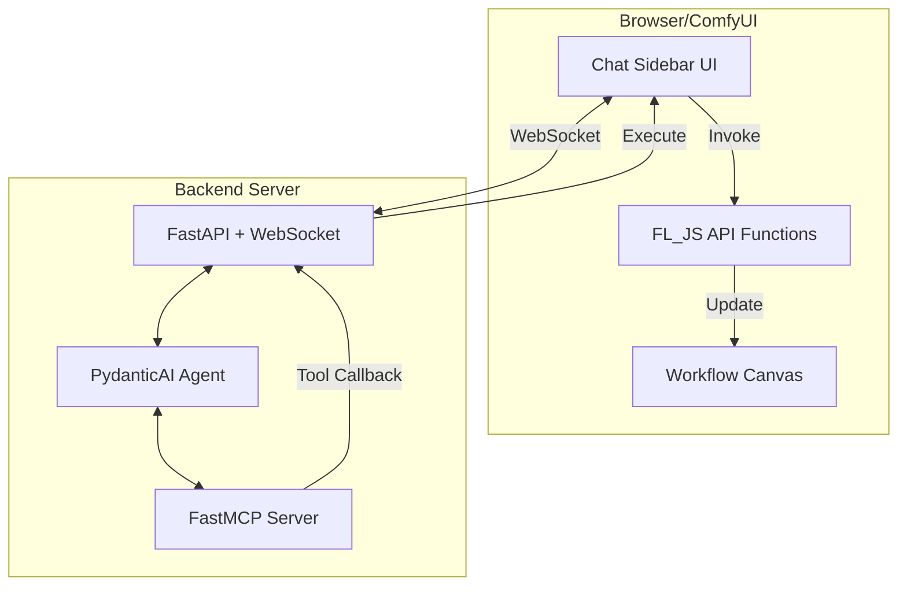

# FL_JS Agentic Workflow Assistant - Roadmap

## Project Vision

Build a modern, AI-powered ComfyUI workflow assistant that combines:
- **Natural language workflow manipulation** via chat interface
- **Real-time bidirectional communication** between UI and AI agent
- **Tool-based architecture** using MCP (Model Context Protocol)
- **Intelligent query and visualization** of workflow state

## Architecture Overview



### Key Components

1. **Frontend (JavaScript)**
   - Chat sidebar interface in ComfyUI
   - WebSocket client for real-time communication
   - Legacy FL_JS API functions (from `legacy/fl_js.js`)
   - Tool execution handlers

2. **Backend (Python)**
   - FastAPI server with WebSocket support
   - PydanticAI agent for natural language understanding
   - FastMCP server wrapping FL_JS functions as tools
   - Tool callback system to JS client

3. **Communication Flow**
   - User sends message via chat UI
   - WebSocket → FastAPI → PydanticAI agent
   - Agent uses MCP tools (which callback to JS via WS)
   - JS executes FL_JS functions, returns results
   - Agent synthesizes response → User

---

## Phase 1: Foundation & Infrastructure

### 1.1 Project Structure Setup
- [ ] Create project directory structure
  ```
  fl_js/
  ├── backend/
  │   ├── server.py          # FastAPI server
  │   ├── agent.py           # PydanticAI agent
  │   ├── mcp_server.py      # FastMCP tool definitions
  │   ├── websocket.py       # WebSocket handlers
  │   └── models.py          # Pydantic models
  ├── frontend/
  │   ├── chat_ui.js         # Chat sidebar component
  │   ├── ws_client.js       # WebSocket client
  │   ├── tool_executor.js   # Tool callback handlers
  │   └── fl_api.js          # FL_JS API wrapper
  ├── legacy/                # Existing FL_JS code
  ├── notes/
  └── tests/
  ```

- [ ] Set up Python environment
  - FastAPI
  - PydanticAI
  - FastMCP
  - WebSockets
  - Pydantic v2

- [ ] Set up development tooling
  - Testing framework (pytest)
  - Linting/formatting (ruff)
  - Type checking (mypy)

### 1.2 WebSocket Communication Layer
- [ ] Implement FastAPI WebSocket endpoint
- [ ] Create message protocol schema (Pydantic models)
  - User messages
  - Agent responses
  - Tool invocation requests
  - Tool execution results
  - Error handling

- [ ] Build JavaScript WebSocket client
  - Connection management
  - Reconnection logic
  - Message serialization/deserialization
  - Event handlers

- [ ] Test bidirectional communication
  - Send message from UI → Backend
  - Receive response Backend → UI
  - Handle connection failures gracefully

### 1.3 Basic Chat UI
- [ ] Create chat sidebar component
  - Message input field
  - Message history display
  - Connection status indicator
  - Typing indicators
  - Error notifications

- [ ] Integrate with ComfyUI
  - Sidebar toggle
  - Styling to match ComfyUI theme
  - Responsive layout

- [ ] Basic message flow (no AI yet)
  - Echo server test
  - Message persistence (optional)

---

## Phase 2: MCP Tool Server

### 2.1 Extract FL_JS API Functions
- [ ] Audit `legacy/fl_js.js` for all available functions
- [ ] Categorize functions by domain:
  - Node Management (find, create, remove, bypass, pin, select)
  - Node Manipulation (getValues, setValues, connect)
  - Layout Management (putOn*, moveTo*, getRect, setRect)
  - Workflow Control (generate, cancel, queue settings)
  - System Control (sleep, screensaver, sendImages)
  - Utilities (generateSeed, generateFloat, generateInt, random)

- [ ] Document function signatures and return types
- [ ] Create TypeScript/JSDoc definitions for type safety

### 2.2 Build FastMCP Server **(first read get_mcp_server_coding_instructions tool output)**
- [ ] Define MCP tool schemas for each FL_JS function
  - Input parameters (Pydantic models)
  - Output schemas
  - Error handling

- [ ] Implement tool callback mechanism
  - Tool invocation → WebSocket message to JS client
  - JS executes function → Returns result via WebSocket
  - MCP tool receives result → Returns to agent

- [ ] Core tool implementations:

#### Node Management Tools
- [ ] `find_node` - Find node by ID, title, or type
- [ ] `find_last_node` - Find last matching node
- [ ] `create_node` - Create new node with parameters
- [ ] `remove_nodes` - Remove one or more nodes
- [ ] `bypass_nodes` - Bypass nodes
- [ ] `unbypass_nodes` - Unbypass nodes
- [ ] `pin_nodes` - Pin nodes
- [ ] `unpin_nodes` - Unpin nodes
- [ ] `select_nodes` - Select nodes

#### Node Manipulation Tools
- [ ] `get_node_values` - Get node parameter values
- [ ] `set_node_values` - Set node parameter values
- [ ] `connect_nodes` - Connect output to input

#### Layout Management Tools
- [ ] `position_node_left` - Position node to left of target
- [ ] `position_node_right` - Position node to right of target
- [ ] `position_node_top` - Position node above target
- [ ] `position_node_bottom` - Position node below target
- [ ] `move_node_right` - Move node to rightmost position
- [ ] `move_node_bottom` - Move node to bottom position
- [ ] `get_node_rect` - Get node position and size
- [ ] `set_node_rect` - Set node position and size

#### Workflow Control Tools
- [ ] `generate_workflow` - Start workflow generation
- [ ] `cancel_workflow` - Cancel current generation
- [ ] `enable_auto_queue` - Enable auto-queue mode
- [ ] `disable_auto_queue` - Disable auto-queue mode
- [ ] `set_batch_count` - Set batch count
- [ ] `queue_workflow` - Queue workflow for execution

#### System Control Tools
- [ ] `disable_sleep` - Disable system sleep
- [ ] `enable_sleep` - Enable system sleep
- [ ] `disable_screensaver` - Disable screensaver
- [ ] `enable_screensaver` - Enable screensaver
- [ ] `send_images` - Send images to URL

#### Utility Tools
- [ ] `generate_seed` - Generate random seed
- [ ] `generate_float` - Generate random float
- [ ] `generate_int` - Generate random integer
- [ ] `random_choice` - Choose random item from list

### 2.3 Tool Execution Handler (JavaScript)
- [ ] Implement tool execution router
  - Receive tool invocation message from WebSocket
  - Map tool name to FL_JS function
  - Execute function with provided parameters
  - Capture result or error
  - Send result back via WebSocket

- [ ] Error handling and validation
  - Parameter validation
  - Node existence checks
  - Connection validation
  - Graceful error messages

- [ ] Add execution logging/debugging
  - Tool invocation logs
  - Execution time tracking
  - Error reporting

---

## Phase 3: Advanced Query & Visualization Tools

### 3.1 Workflow Query Tool

**Goal**: Provide structured querying of the workflow DAG

#### Query Language Design
- [ ] Define query structure (consider options):
  - **Option A**: JSON-based query DSL
    ```json
    {
      "type": "filter",
      "node_type": "CheckpointLoader",
      "parameters": {"ckpt_name": {"contains": "sd15"}}
    }
    ```
  - **Option B**: SQL-like syntax
    ```sql
    SELECT nodes WHERE type = 'CheckpointLoader' AND ckpt_name LIKE '%sd15%'
    ```
  - **Option C**: GraphQL-inspired
    ```graphql
    nodes(type: "CheckpointLoader", params: {ckpt_name: {contains: "sd15"}}) {
      id, title, position, parameters, connections
    }
    ```

- [ ] Implement query parser
- [ ] Support query operations:
  - Filter by node type
  - Filter by parameter values
  - Filter by position (bounding box)
  - Filter by connections (upstream/downstream)
  - Traversal queries (ancestors, descendants)

#### Node Representation
- [ ] Define standard node output format:
  ```json
  {
    "id": 123,
    "type": "CheckpointLoader",
    "title": "My Checkpoint",
    "position": {"x": 100, "y": 200},
    "parameters": {"ckpt_name": "sd15.safetensors"},
    "connections": {
      "inputs": [],
      "outputs": [
        {"slot": "MODEL", "connected_to": [{"node_id": 124, "slot": "model"}]}
      ]
    }
  }
  ```

#### Query Tool Implementation
- [ ] `query_workflow` MCP tool
  - Input: Query object/string
  - Output: List of matching nodes (with structure above)
  - Support scalar returns (count, exists, etc.)

- [ ] JavaScript query executor
  - Parse query
  - Traverse workflow graph
  - Apply filters
  - Return formatted results

- [ ] Query optimization
  - Index frequently queried properties
  - Cache query results (with invalidation)

### 3.2 Workflow Visualization Tool

**Goal**: Generate Mermaid diagrams of workflow structure

- [ ] `workflow_overview` MCP tool
  - Input: Optional subgraph specification (node IDs or query)
  - Output: Mermaid diagram string

- [ ] Diagram generation logic
  - Full workflow diagram
  - Subgraph extraction
  - Connection visualization
  - Node grouping by type
  - Simplified vs. detailed modes

- [ ] Example output:
  ```mermaid
  graph LR
    N1[CheckpointLoader] --> N2[CLIPTextEncode]
    N1 --> N3[VAELoader]
    N2 --> N4[KSampler]
    N3 --> N4
    N4 --> N5[VAEDecode]
    N5 --> N6[SaveImage]
  ```

- [ ] Visualization options:
  - Show/hide parameter values
  - Color coding by node type
  - Highlight error nodes
  - Show execution order

### 3.3 Workflow Inspection Tools
- [ ] `get_workflow_stats` - Overall workflow statistics
  - Node count by type
  - Connection count
  - Execution status
  - Estimated generation time

- [ ] `get_node_chain` - Get execution chain from node A to B
  - Input: Start node, end node
  - Output: List of nodes in execution path

- [ ] `validate_workflow` - Check for workflow issues
  - Disconnected nodes
  - Missing required inputs
  - Type mismatches
  - Circular dependencies

---

## Phase 4: PydanticAI Agent Integration

### 4.1 Agent Setup
- [ ] Initialize PydanticAI agent
  - Choose LLM provider (OpenAI, Anthropic, etc.)
  - Configure model parameters
  - Set up system prompt

- [ ] System prompt engineering
  - Define agent role (ComfyUI workflow assistant)
  - Explain available tools
  - Set interaction guidelines
  - Include workflow best practices

- [ ] Register MCP tools with agent
  - Connect FastMCP server to PydanticAI
  - Configure tool calling behavior
  - Set up tool result processing

### 4.2 Agent Capabilities
- [ ] Natural language workflow manipulation
  - "Create a text-to-image workflow using SD 1.5"
  - "Connect the VAE to the sampler"
  - "Move all checkpoint loaders to the left"

- [ ] Workflow querying
  - "Show me all KSampler nodes"
  - "What checkpoint is being used?"
  - "Which nodes are connected to node 5?"

- [ ] Workflow analysis
  - "Visualize the current workflow"
  - "Are there any disconnected nodes?"
  - "What's the execution order?"

- [ ] Workflow execution
  - "Run the workflow"
  - "Queue 5 batches"
  - "Cancel the current generation"

### 4.3 Context Management
- [ ] Conversation history
  - Maintain context across messages
  - Reference previous actions
  - Undo/redo support

- [ ] Workflow state tracking
  - Track changes made by agent
  - Detect external workflow changes
  - Sync state between agent and UI

- [ ] Multi-turn interactions
  - Clarification questions
  - Incremental workflow building
  - Iterative refinement

---

## Phase 5: Feedback & Execution

### 5.1 Workflow Execution Tool
- [ ] `queue_and_monitor` tool
  - Queue workflow for execution
  - Monitor execution progress
  - Capture execution events
  - Return execution results

- [ ] Execution result handling
  - Success/failure status
  - Generated images (if applicable)
  - Execution time
  - Error messages

### 5.2 Feedback Loop Integration
- [ ] Agent feedback mechanisms
  - Execution success → Positive feedback
  - Execution failure → Error analysis
  - Agent learns from outcomes

- [ ] Iterative improvement
  - Agent suggests fixes for failed workflows
  - Parameter tuning based on results
  - Workflow optimization recommendations

- [ ] Result inspection
  - "Show me the generated image"
  - "What went wrong with the last execution?"
  - "How long did it take to generate?"

### 5.3 Advanced Execution Features
- [ ] Batch execution monitoring
  - Track progress across batches
  - Aggregate results
  - Performance metrics

- [ ] Execution history
  - Log all executions
  - Compare results over time
  - Replay previous workflows

- [ ] Conditional execution
  - Execute only if validation passes
  - Retry on failure
  - Timeout handling

---

## Phase 6: Polish & Optimization

### 6.1 Performance Optimization
- [ ] WebSocket message batching
- [ ] Tool call caching
- [ ] Workflow state diffing (only send changes)
- [ ] Lazy loading of large workflows
- [ ] Query result pagination

### 6.2 Error Handling & Resilience
- [ ] Comprehensive error messages
- [ ] Graceful degradation
- [ ] Retry logic for transient failures
- [ ] Connection recovery
- [ ] State reconciliation after disconnection

### 6.3 User Experience
- [ ] Loading states and progress indicators
- [ ] Syntax highlighting for code snippets
- [ ] Markdown rendering in chat
- [ ] Mermaid diagram rendering in chat
- [ ] Keyboard shortcuts
- [ ] Dark/light theme support

### 6.4 Developer Experience
- [ ] Comprehensive documentation
  - API reference
  - Tool catalog
  - Query language guide
  - Example workflows

- [ ] Debugging tools
  - Tool invocation logs
  - WebSocket message inspector
  - Agent reasoning traces

- [ ] Testing
  - Unit tests for all tools
  - Integration tests for agent flows
  - E2E tests for chat interactions
  - Performance benchmarks

### 6.5 Security & Safety
- [ ] Input validation and sanitization
- [ ] Rate limiting
- [ ] Authentication (if needed)
- [ ] Tool execution permissions
- [ ] Audit logging

---

## Phase 7: Advanced Features (Future)

### 7.1 Multi-Agent Collaboration
- [ ] Specialized agents for different tasks
  - Layout agent
  - Parameter optimization agent
  - Debugging agent

- [ ] Agent coordination
- [ ] Task delegation

### 7.2 Workflow Templates & Patterns
- [ ] Template library
  - Common workflow patterns
  - Reusable components
  - Best practices

- [ ] Template instantiation
  - "Create a workflow from template X"
  - Parameter customization

### 7.3 Learning & Personalization
- [ ] User preference learning
  - Preferred node types
  - Common parameter values
  - Layout preferences

- [ ] Workflow suggestions
  - "You might want to add..."
  - "Consider using... instead"

### 7.4 Integration & Export
- [ ] Workflow sharing
  - Export workflow as JSON
  - Share via URL
  - Import from community

- [ ] Version control integration
  - Git integration
  - Workflow versioning
  - Change tracking

---

## Success Metrics

### Technical Metrics
- [ ] WebSocket latency < 100ms
- [ ] Tool execution time < 500ms (average)
- [ ] Agent response time < 3s (average)
- [ ] 99.9% uptime
- [ ] Zero data loss on disconnection

### User Experience Metrics
- [ ] Natural language understanding accuracy > 90%
- [ ] Tool call success rate > 95%
- [ ] User task completion rate
- [ ] Time saved vs. manual workflow creation

### Code Quality Metrics
- [ ] Test coverage > 80%
- [ ] Type coverage > 90%
- [ ] Zero critical security issues
- [ ] Documentation completeness

---

## Dependencies & Technology Stack

### Backend
- **FastAPI** - Web framework with WebSocket support
- **PydanticAI** - AI agent framework
- **FastMCP** - MCP server implementation
- **Pydantic v2** - Data validation
- **uvicorn** - ASGI server
- **python-websockets** - WebSocket library

### Frontend
- **Vanilla JavaScript** - Core implementation
- **WebSocket API** - Real-time communication
- **Mermaid.js** - Diagram rendering
- **Marked.js** - Markdown rendering (optional)
- **ComfyUI API** - Workflow integration

### Development
- **pytest** - Testing framework
- **ruff** - Linting and formatting
- **mypy** - Type checking
- **pre-commit** - Git hooks

### Infrastructure
- **Docker** - Containerization (optional)
- **Redis** - Caching (optional, future)
- **PostgreSQL** - Persistence (optional, future)

---

## Migration from Legacy

### What to Keep
- ✅ FL_JS API functions (`legacy/fl_js.js`)
- ✅ Event system concepts
- ✅ Node manipulation patterns
- ✅ Layout algorithms

### What to Replace
- ❌ Direct Gemini API calls → PydanticAI agent
- ❌ Node scanner → Dynamic tool discovery
- ❌ Inline code execution → Tool-based architecture
- ❌ Widget-based UI → Chat sidebar

### Backward Compatibility
- Legacy FL_JS nodes can coexist
- Gradual migration path
- Documentation for migration

---

## Notes & Considerations

### Query Language Decision
- **Recommendation**: Start with JSON-based DSL (Option A)
- **Reasoning**: 
  - Easier for LLM to generate
  - Type-safe with Pydantic
  - Extensible
  - Can add SQL-like syntax later as sugar

### WebSocket vs REST
- **WebSocket**: Real-time bidirectional communication
  - Tool callbacks
  - Agent streaming responses
  - Workflow state updates
- **REST**: Optional for stateless operations
  - Health checks
  - Configuration
  - File uploads

### Tool Granularity
- Start with one tool per function
- Can combine related tools later if needed
- Agent learns optimal tool combinations

### Execution Feedback
- Critical for agent learning
- Consider structured feedback format
- Track success/failure patterns
- Use for prompt engineering

---

## Getting Started

### Immediate Next Steps
1. Set up project structure (Phase 1.1)
2. Create basic WebSocket communication (Phase 1.2)
3. Build minimal chat UI (Phase 1.3)
4. Test end-to-end message flow
5. Begin MCP tool server (Phase 2.1)

### Recommended Development Order
1. **Phase 1** - Foundation (1-2 weeks)
2. **Phase 2** - MCP Tools (2-3 weeks)
3. **Phase 3** - Query & Viz (1-2 weeks)
4. **Phase 4** - Agent Integration (1 week)
5. **Phase 5** - Execution & Feedback (1-2 weeks)
6. **Phase 6** - Polish (ongoing)
7. **Phase 7** - Advanced Features (future)

### Risk Mitigation
- **WebSocket complexity**: Start with simple echo server
- **Tool callback latency**: Implement timeout and retry logic
- **Agent hallucination**: Strong tool schemas and validation
- **Query language complexity**: Start simple, iterate based on usage
- **Execution reliability**: Comprehensive error handling and logging

---

## References

- Legacy code: `legacy/fl_js.js`, `legacy/fl_wf_agent.js`
- Project structure: `notes/project_structure.md`
- Future ideas: `notes/looking_forward.md`
- FastMCP: https://github.com/jlowin/fastmcp
- PydanticAI: https://ai.pydantic.dev/
- FastAPI WebSockets: https://fastapi.tiangolo.com/advanced/websockets/
